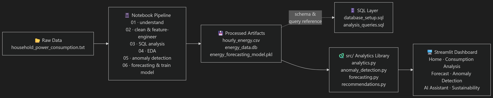

# AI-Powered Sustainable Energy Analytics

An end-to-end energy analytics project: data cleaning and SQL analysis, hourly anomaly detection, consumption forecasting, and rule-based sustainability recommendations, all presented in a multi-page Streamlit dashboard. IBM Bob was used during development for architecture review, code review and documentation support.

## Features

- **Consumption analysis:** KPIs and usage patterns by hour, day and period (`src/analytics.py`, `sql/kpi_queries.sql`).
- **Anomaly detection:** hourly baselines with z-scores to flag unusual readings (`src/anomaly_detection.py`).
- **Energy forecasting:** a Random Forest regression model trained in notebook 06 and served through `src/forecasting.py`.
- **Recommendations:** a rule-based engine that turns consumption, anomaly and forecast results into practical energy-saving suggestions (`src/recommendations.py`).
- **AI Assistant page:** a conversational page in the dashboard for asking questions about the data.
- **Sustainability page:** a summary of efficiency and sustainability insights.

## Architecture



Raw data is cleaned and engineered in the notebooks, stored as processed CSV files and a database, and then consumed by the `src/` modules. The trained model and those modules feed the Streamlit dashboard.

## Project Structure

```
AI-Sustainable-Energy-Analytics/
├── data/
│   └── processed/          # hourly_energy.csv, hourly_energy_with_anomalies.csv, energy_data.db
├── notebooks/
│   ├── 01_data_understanding.ipynb
│   ├── 02_data_cleaning.ipynb
│   ├── 03_sql_analysis.ipynb
│   ├── 04_eda.ipynb
│   ├── 05_anomaly_detection.ipynb
│   └── 06_energy_forecasting.ipynb
├── src/
│   ├── analytics.py
│   ├── anomaly_detection.py
│   ├── forecasting.py
│   └── recommendations.py
├── sql/
│   ├── database_setup.sql
│   ├── kpi_queries.sql
│   └── analysis_queries.sql
├── models/
│   └── energy_forecasting_model.pkl
├── dashboard/
│   ├── app.py
│   └── pages/
│       ├── 1_Consumption_Analysis.py
│       ├── 2_Forecast.py
│       ├── 3_Anomaly_Detection.py
│       ├── 4_AI_Assistant.py
│       └── 5_Sustainability.py
├── ibm_bob/
│   ├── prompts.md
│   ├── workflow.md
│   └── screenshots/
├── docs/
│   ├── architecture.png
│   └── responsible_ai.md
├── requirements.txt
└── README.md
```

## Getting Started

### 1. Clone the repository

```bash
git clone https://github.com/harshitarathor/AI-Sustainable-Energy-Analytics.git
cd AI-Sustainable-Energy-Analytics
```

### 2. Create a virtual environment and install dependencies

```bash
python -m venv venv
venv\Scripts\activate        # Windows
# source venv/bin/activate   # macOS / Linux
pip install -r requirements.txt
```

### 3. Run the dashboard

Run this from the project root, because the app loads the model using a relative path (`models/energy_forecasting_model.pkl`).

```bash
streamlit run dashboard/app.py
```

## Notes on the Model

The forecasting model is a scikit-learn `RandomForestRegressor` saved with `joblib` using compression (about 58 MB). Load it with `joblib.load(...)`, not `pickle.load(...)`. To retrain it, run `notebooks/06_energy_forecasting.ipynb`.

## Notebooks

| Notebook | Purpose |
|---|---|
| 01_data_understanding | Explore the raw dataset and its structure |
| 02_data_cleaning | Handle missing values, types and resampling to hourly data |
| 03_sql_analysis | SQL-based analysis using the queries in `sql/` |
| 04_eda | Exploratory data analysis and visualisation |
| 05_anomaly_detection | Build and validate the hourly baseline anomaly detector |
| 06_energy_forecasting | Train, evaluate and save the forecasting model |

## Built with IBM Bob

IBM Bob was used as an AI development assistant for project overview, architecture diagrams and code review. The prompts used, the results, and what was changed as a result are documented in:

- [`ibm_bob/prompts.md`](ibm_bob/prompts.md)
- [`ibm_bob/workflow.md`](ibm_bob/workflow.md)
- [`ibm_bob/screenshots/`](ibm_bob/screenshots/)

## Responsible AI

Anomaly flags and recommendations are decision-support signals, not verdicts. See [`docs/responsible_ai.md`](docs/responsible_ai.md) for limitations, false-alarm risks and guidance on human oversight.

## Tech Stack

Python, pandas, scikit-learn, SQL, Streamlit, Jupyter, joblib.

